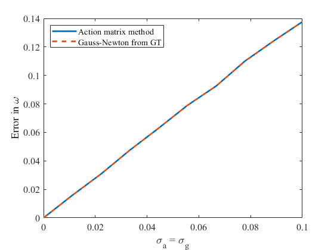
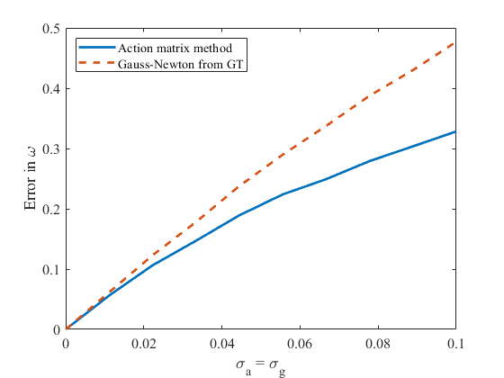

# Minimal solvers for multi-camera and IMU calibration
Given a moveable rig consisting of three cameras with corresponding IMUs, use IMU data to find the position and orientation of the cameras. We assume that there is a known rigid transform from a camera to its IMU. This will be based on previous work by Isaac Skog et al. [1] and Håkan Carlsson et al. [2]. In [2] the calibration was performed using a coordinate descent method in combination with classical non-linear least squares methods. These methods may not always converge or may converge slowly. In this project we will investigate whether the solution could be made more robust and/or faster by utilizing the action matrix method (see e.g. Section 7 in the introduction of Viktor Larsson's thesis [Computational Methods for Computer Vision: Minimal Solvers and Convex Relaxations](https://portal.research.lu.se/portal/en/publications/computational-methods-for-computer-vision%28cc1ae2a2-409d-414c-87e0-ec381d22649d%29.html)). With this method the problem can be transformed into an eigen decomposition problem for which there are fast numerically stable solvers. Additionally, this method is a global optimization method that does not need to be initialized.

## Getting started
All code is written in MATLAB and can be found in the `matlab` folder. Within that folder, `solveImuArray.m` is the action matrix solver which will be compared to the interative Gauss-Newton solver `solveImuArrayMl.m`. Scripts for testing the numerics of the two solvers for various amounts of noise can be found in the `tests` folder

## Preliminary results
When the errors in the accelerometers are i.i.d. with standard deviation σa and the error in the gyroscope are i.i.d. with standard deviation σg, the likelihood function in [1] has in general 19 (complex) stationary points. When there is at least one gyroscope present experiments show that there is only one real stationary point - a global maximum. This makes it impossible for any interative optimization method to get stuck on local (non-global) maxima. When gyroscope measurments are available these such methods also have a good starting point and should converge quickly. This makes the use of the more complicated action matrix method unjustified. The figure below shows the error in estimate ω for different levels of noise σ when one gyroscope is present.

However, when no gyroscopes are present the likelihood function has most often 11 real stationary points and iterative methods risk getting stuck on local maxima. Additionally, it is no longer trivial to find a starting value for the optimization. In the appendix of [1] a method for finding a starting point was mentioned but it requires at least four accelerometers spanning the 3D space. Using the action matrix method all stationary points can be found without providing a starting point. The global maximum can then be found by insertion into the likelihood function. The figure below shows the error in estimate ω for different levels of noise σ when no gyroscopes are present. When the solvers produce multiple solutions the one with the lowest error was picked.

## References
[[1]](https://ieeexplore.ieee.org/document/7462272) I. Skog (2016) Inertial Sensor Arrays, Maximum Likelihood, and Cramér–Rao Bound

[[2]](https://ieeexplore.ieee.org/document/8115879) H. Carlsson (2017) On-the-fly geometric calibration of inertial sensor arrays
